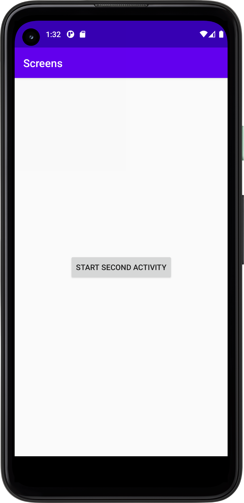
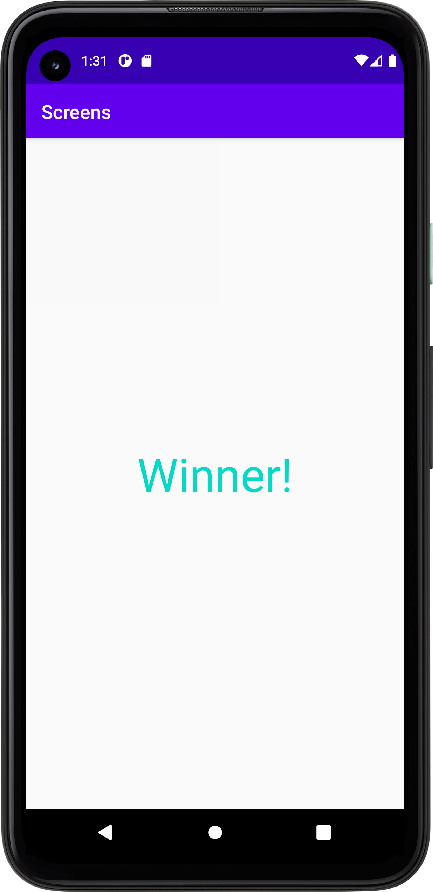

För att skapa en andra aktivitet högerklickade jag på "app" valde new/actvitiy/empty activity, jag döpte aktiviteten till scondactivity
och fick då en till java klass vid namn second activity och en layoutfil vid namn activity_second.

Jag skapade en knapp i activity main som enkelt har texten "starta andra aktivitet" gav den en action listener som vid tryck startar metoden second i
main activity. När metoden kalls skapas ett intent som startar second activity. 
```
public void second(View view) {
Intent intent = new Intent(MainActivity.this, SecondActivity.class);
startActivity(intent);
}
```

För att skicka data från min första aktivitet till den andra avänds extras. Jag kompletterade metoden second som startar den andra aktiviteten med
"intent.putExtra()" jag matade då in en string som enkelt säger Winner. 

```
public void second(View view) {
Intent intent = new Intent(MainActivity.this, SecondActivity.class);
intent.putExtra("string", "Winner!");
startActivity(intent);
}
```
 Jag skapade en textview i `activity_second.xml` och hämtade värdet som skickats med extras genom följande rad kod, jag anänvder "string" som nyckel
 för att komma åt "Winner!" som lagrats i `MainActivity.java`. Sedan sätter jag in denna string i min textview så att datan som skickats från 
 första aktiviten till andra aktivetien visas. 
```
Bundle extras = getIntent().getExtras();
if (extras != null) {
String name = extras.getString("string");

            TextView textView = (TextView) findViewById(R.id.textView);
            textView.setText(name);


        }
```




